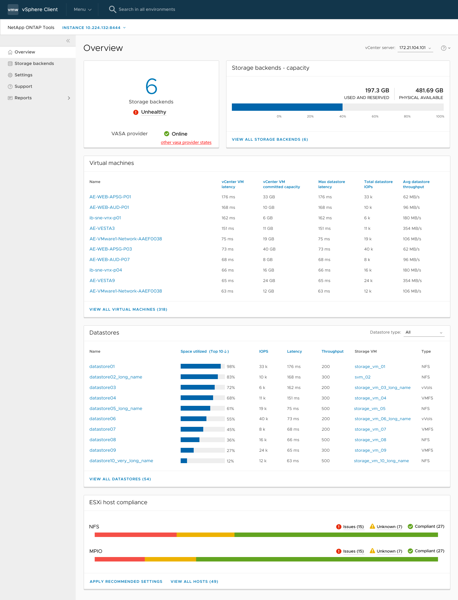

= 適用於 VMware vSphere 外掛程式儀表板的 NetApp ONTAP 工具總覽
:allow-uri-read: 
:icons: font
:imagesdir: ../media/

[role="lead"]
當您在 vCenter 用戶端的捷徑區段中選取適用於 VMware vSphere 外掛程式的 NetApp ONTAP 工具圖示時、使用者介面會導覽至概要頁面。此頁面類似儀表板、提供 VMware vSphere 外掛程式的 ONTAP 工具摘要。

在增強連結模式設定（ Elm ）的情況下、 vCenter Server Select 下拉式清單會出現、您可以選取所需的 vCenter Server 來查看與其相關的資料。此下拉式清單可用於外掛程式的所有其他清單檢視。在一個頁面中所做的 vCenter Server 選擇會持續出現在外掛程式的索引標籤上。

儀表板有幾張顯示系統不同元素的卡片。下表顯示不同的卡片及其代表的內容。

|===

| * 卡片名稱 * | *說明* 

| 狀態 | 狀態卡會顯示已新增的儲存後端數量、以及儲存後端的整體健全狀況狀態、以及 vCenter 的 VASA Provider 狀態。當所有儲存設備的後端狀態均正常時、儲存設備後端狀態會顯示為「健全」。如果任何一個儲存設備後端有問題（未知 / 無法連線 / 降級狀態）、儲存設備後端狀態會顯示為「不正常」。當您按一下「不良」狀態時、會開啟一個工具提示、顯示儲存設備後端的狀態。您可以按一下任何儲存後端以取得更多詳細資料。其他 VASA Provider （ VP ）狀態連結會顯示 vCenter Server 中登錄的 VP 目前狀態。 

| 儲存設備後端 - 容量 | 此卡顯示所選 vCenter Server 執行個體所有儲存後端的已使用容量和可用容量。 

| 虛擬機器 | 此卡顯示依效能指標排序的前 10 名 VM 。您可以按一下標頭、以取得所選度量的前 10 個 VM 、並依遞增或遞減順序排序。在您變更或清除瀏覽器快取之前、對卡片所做的排序和篩選變更會持續存在。 

| 資料存放區 | 此卡顯示依效能計量排序的前 10 個資料存放區。您可以按一下標頭、以取得所選度量的前 10 個資料存放區、並依遞增或遞減順序排序。在您變更或清除瀏覽器快取之前、對卡片所做的排序和篩選變更會持續存在。資料存放區類型下拉式清單可選取資料存放區類型： NFS 、 VMFS 或 vVols 。 

| ESXi 主機相容性卡 | 此卡片會根據設定群組 / 類別、顯示所有 ESXi 主機（針對所選 vCenter ）設定的整體相容性狀態、以及建議的 NetApp 主機設定。您可以按一下「套用建議的設定」連結來套用建議的設定。您可以按一下「問題 / 未知」來查看主機清單。 
|===